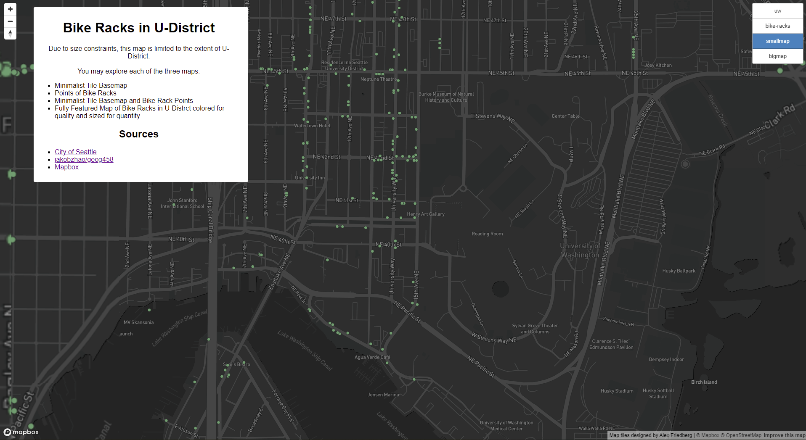

# geog458-lab4
[https://blueal.github.io/geog458-lab4/](https://blueal.github.io/geog458-lab4/)

## Basemap and Tile Generation

This lab project had us examining and practicing the creation of basemaps and tile generation with Mapbox and QGIS.

## Examined Geographical Area
Due to filesize constraints, I had limited the extent to UW and U-Distrct. This is required due to the files being hosted on GitHub, and it made tile generation significantly faster and easier to manage.

The exact study area is U-Distrct bounded by I-5 to Union Bay. 45th to Portage Bay. This is the exact area shown in the screenshots below.

## Zoom Levels
The zoom levels available for each tile set is 0-18. However, due to the small study area, the full zoom extent may not be practicablly usable.

## Tile Sets
### UW Basemap:

You will see in this basemap a lack of many features, diffeent fonts, labels removed for most things, and a generally simpler layout. Due to caching problems, this may appear differently at different zooms, this was not intentially.

### UW Bike Rack Points:

This map features a simple collection of raw point data of SDOT bike racks around U-Distrct and UW. As can be clearly seen, no bike racks opened by SDOT appear on campus.

### UW Basemap and Bike Rack:

A combined tileset of the UW Basemap and Bike Rack points.

### Bike Racks around UW:

A fully featured map depicting Bike Racks around UW. The basemap was changed to highlight the colors more. This basemap was chosen because it shows road features, and parks fairly well. The color of dot referenced the quality of the rack.
- Green - Good
- Yellow - Fair
- Red - Poor
- Black - Unknown

The size of the rack references the quantity of known spots available at a graduated scale:
- 5px - 1
- 20px - 50